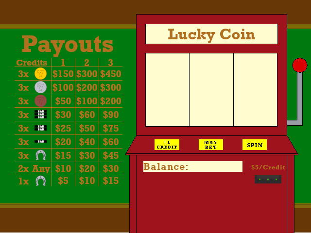

# fa21-final-project-group_15
fa21-final-project-group_15 created by GitHub Classroom

**Team member responsibility** 
**Harry Chou **  
I responsible mainly of the main user interface, tone generation, and game logic.  
I responsible for the 3 files below under Driver and Application folder. 
main_video_test.cpp, 
vga_core.cpp, 
vga_core.h

**Peter **  
Conributions to the project include initial UI design, (unimplemented) concept art, graphic conversion for use in hardware, and (unimplemented) sprite and background display hardware.

**Abstract** 
The focus of our final project is to implement a slot machine game on an FPGA using a MicroBlaze microcontroller system. Our game will feature VGA graphics, audio, and mouse interactivity. The player will start with $1,000 in-game dollars and can bet portions of their holdings per round. At the end of the round, the player’s holdings may increase, depending on how the player bet and the combination of game elements on the screen. If the player’s holdings drop to zero, the game is over. Otherwise, the player’s holdings will increase until the holdings counter is maxed out. Our project will be implemented on a Nexys 4 DDR FPGA and will use the on-board VGA port, audio jack, and USB port for creating the user experience.
 

**Description:** 
The purpose of this project was to implement a standalone casino slots game on a Nexys 4 FPGA. The initial concept featured a custom background (as shown in Figure 1) with a simple UI that allowed the user to play multiple rounds of slots until their money counter fell to $0 or until the player maxed out the money counter. The game would also include audible feedback for the user's inputs.  
  
During this project's development there were a few challenges that we were unable to surpass. To simulate the visuals of an actual slot machine, we created an image that contained multiple play elements that would appear on a slot reel (as shown in Figure 2). The concept was that this reel would be stored on the board's memory and can be instantiated as part of a frame on a screen transmitted via vga. The image was larger than the target sprite size (a 64 px x 64 px sprite in its final form) and the sprite would become animated by displaying switching segments of the larger image. To accomplish this goal, we attempted to repurpose the ghost sprite core to scroll through our reel image, which was encoded as a pallete map in a text file. For reasons unknown, no part of the reel was displayed when the sprite core was instantiated in the application loaded onto the board.  
  
Along with this, we attemtped to store a 640 px x 480 px background in a similar fashion on the FPGA's memory. Despite minimizing the amount of memory this image used, we were unable to display the background as well. The most we were able to display was a monocolor background of the first color stored in the memory file.  
  
While we were unable to demonstrate the visual portion of this project, we were still able to code the game rules and run a functioning game. The unimplemented HDL code that was meant to implement the graphics is stored in the "code_not_implemented" folder. A video linked below demonstrates a game of chance being run on the FPGA.

Since we could not get those background and reel image to display, we are using HDL code from Lab 13 to demonstrate the functionality of the game. For the driver and application parts, we only changed main_video_test.cpp, vga_core.cpp, vga_core.h located in (ECE4305LFinal/Drivers and Application/ ). We're successful in implemeting all game logic and the User interface. In place of reel, we are using the ghost sprite animation. Three numbers will appear everytime the user hit spin buttons. Notes: Value 10 = ':', 11 = ';' ,12 = '<', and 13 = '='. These 3 number corresponding to reel locations. Those 3 numbers will determined how the user get payout based on payout rules in Figure 1. In place of the background picture, we write simple text and rectangle shapes to demonstrate the functionality of +1C, Max, and Spin buttons.
   
**Basic Rules: **
Each game start the user with $1000  
The user will only be able to bet the maximum of 3 credit. 
Each credit cost the user $5 dollars. 
Payout will be rewards to the balance. 

     
   Figure 1: Background picture and payout rules
     
     
   Figure 2: Reel picture to implementation the reel animation
  
   

[Demo](https://youtu.be/LeUd1EpBdn0)
